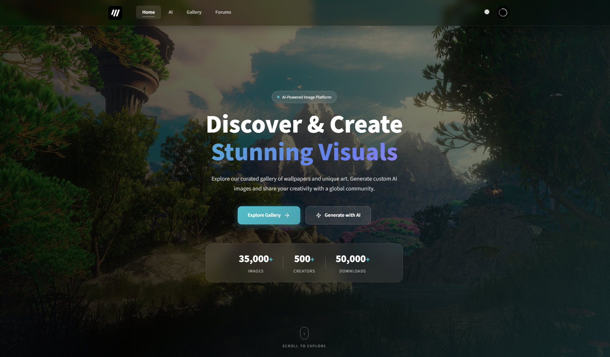
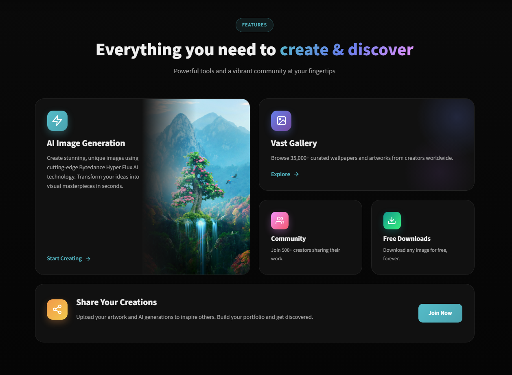
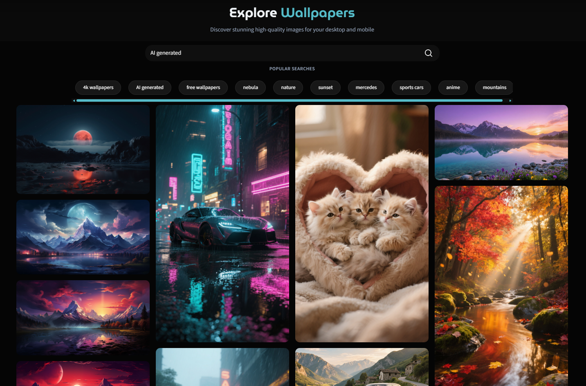
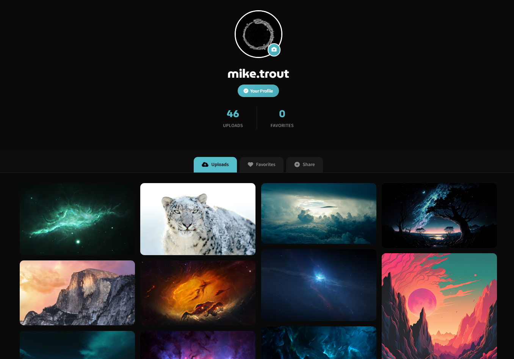
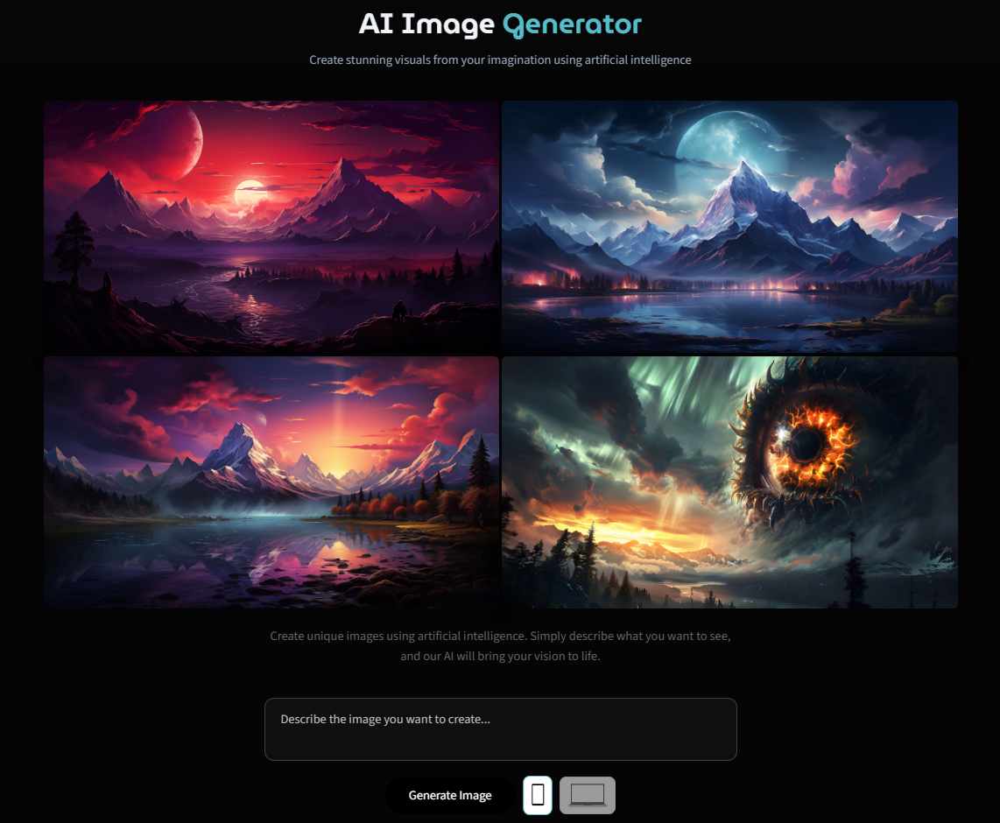

# Wallify

I built this app was originally for a client and maintain it here as a local fork. I recently updated the UI to modernize the look and improve mobile behavior. Original Version can be viewed here https://github.com/liamCarra/wall-application-OS

## Features

- User accounts with basic profile customisation
- Image uploads and gallery browsing
- Favorites / save images
- Simple forums / threads (support)
- AI image generation interface (generates wallpapers in different aspect ratios)
- Responsive UI with dark mode support
- Image download and sharing actions

## Screenshots

Below are a few screenshots of the app UI (stored in `src/app/static/images/ui/`). Click any image to view it full-size on GitHub.

- Home (hero):

	

- More Home:

	

- Gallery:

	

- Profile:

	

- AI Generator:

	
